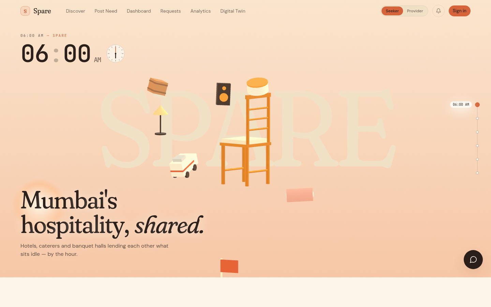
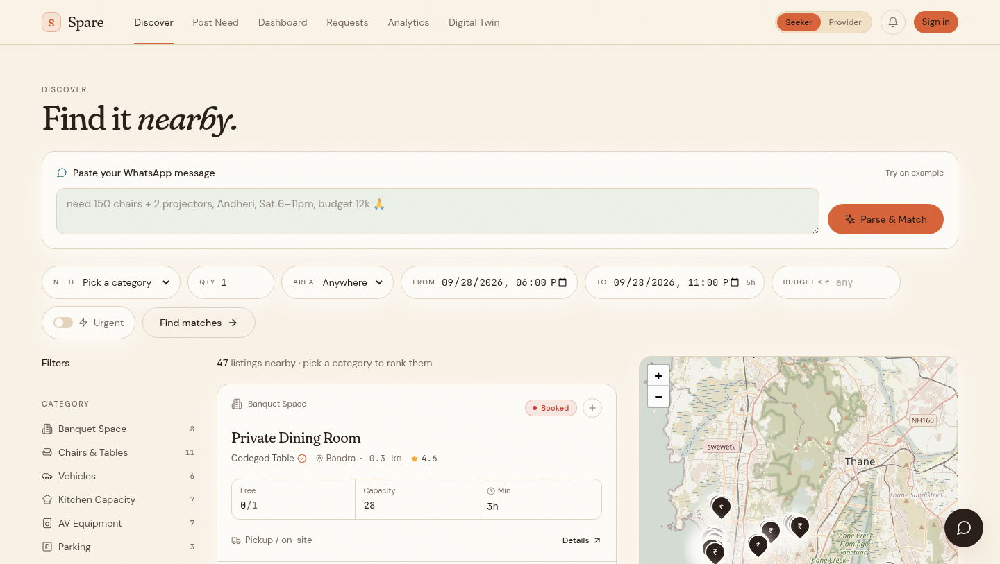

<p align="center">
  
</p>

# Spare

Hospitality businesses in Mumbai rent each other’s idle capacity. A hotel, hall, caterer, or event company posts what it needs. Spare finds providers who can cover it, sometimes more than one, and keeps the booking, the contract, and every physical chair on the same record.

**Live site:** [hre-client.vercel.app](https://hre-client.vercel.app)  
**API:** [hre.onrender.com](https://hre.onrender.com)

One company signs in and can switch between two roles. A **seeker** rents. A **provider** lists and fulfills. Each company sees only its own requests, listings, contracts, and chat.

<p align="center">
  
</p>

---

## What you can do

| | |
|---|---|
| **Discover** | Browse banquet space, chairs and tables, vehicles, kitchen capacity, AV, parking, and linen. Filter by area, time, and quantity. |
| **Request** | Ask for a quantity and a window. The provider accepts, counters, or declines. Accept locks the booking and holds inventory in the same step. |
| **Contract** | One contract per provider. The provider signs the printed copy at dispatch. The seeker signs when the goods arrive. |
| **Units** | Every chair or item has its own code and QR. The booking stores a count. The exact units are chosen at dispatch by scanning. |
| **Handover** | Three phases: dispatch, receipt, return. Photos of the labels decide what left, what arrived, what is short, damaged, or missing. |
| **Assistant** | The Spare assistant searches listings, prepares a booking, and waits for a confirm tap before anything is sent. |
| **Digital twin** | Live weather and a what-if simulation for rain, heat, and wind. The simulation is a projection. It does not change bookings or inventory. |
| **Phone** | An Expo app for the same API: a Mumbai landing story, discover, requests, dashboard, and analytics. |

<p align="center">
  
</p>

---

## How a booking moves

```text
Posted  →  Accepted & locked  →  In use  →  Completed
```

| Status | What actually moves it |
|---|---|
| Accepted and locked | The provider accepts. Inventory is held then. There is no second confirm button. |
| In use | The provider signs the dispatch copy. The clock reaching the start time does not do this. |
| Completed | The provider approves the return, or both sides agree a return dispute. |

The start and end times stay on the request as the schedule. A dispute closes only when both sides agree. The seeker can dispute only within one hour of arrival. The provider can dispute when the goods come back. The security deposit is at least three times the rent, and only the seeker pays it.

### A unit’s life

```text
In stock  →  Sent  →  Received  →  back to In stock
                              ↘  Damaged or Missing
```

Dispatch photos move units from in stock to sent, and the listing’s available count goes down. A clean return puts them back in stock and the count goes back up, never above the listing quantity. Shortage and missing returns come from comparing the scanned sets. Damage needs photos and the specific units ticked.

The QR on the contract opens the handover page.

---

## The assistant

The chat on the website is the Spare assistant. It can search nearby listings, list the company’s requests, prepare a booking or a counter-offer, and answer weather questions.

Two pieces share the job:

- **Nugen** writes the reply. The deployed model is the domain-aligned Qwen model trained on `spare-nugen-domain.md`.
- **Spare’s server** runs the tools. Search, booking, and weather hit the real database and the real weather API. A confirm card is not a booking. Nothing is sent until the person taps Confirm.

A clear request such as “150 chairs in Andheri this Saturday, 6–11 pm” searches immediately and shows bookable cards.

The local Python model in `ai/` is the fallback when `NUGEN_API_KEY` and `NUGEN_MODEL_ID` are not set. With those two set, you do not start `pnpm dev:ai`.

---

## Repository

```text
.
├── client/     Website. React 18, Vite, Tailwind. http://localhost:3100
├── server/     API. Express, Prisma, PostgreSQL.  http://localhost:5000
├── mobile/     Expo app for the same API
├── ai/         Optional local model on port 8008
└── spare-nugen-domain.md
```

Package manager is **pnpm 9.15.4**. Node 20.

### Website

React 18, TypeScript, Vite, Tailwind, TanStack Query, Zustand, React Hook Form, Zod, Framer Motion, GSAP, Lenis, React Three Fiber. Sign-in is Clerk. Listing photos and handover photos go to Cloudinary.

| Route | Page |
|---|---|
| `/` | Landing. A day in Mumbai. |
| `/discover` | Marketplace |
| `/resource/:id` | Listing |
| `/dashboard` | Home for the signed-in company |
| `/requests` | Requests, offers, and the timeline |
| `/analytics` | Procurement and fulfillment |
| `/digital-twin` | Weather map and simulation |
| `/contract/:id` | Printable contract and QR |
| `/handover/:id` | Dispatch, receipt, return |
| `/labels/:id` | QR sheet for every unit |

### API

Express and Prisma on Neon Postgres. Clerk checks the bearer token and attaches the signed-in company. The important routes sit under `/api`: listings, bookings, contracts, handover, chat, and `/api/digital-twin`. `GET /api/health` returns `{"status":"ok"}`.

### Phone

Expo SDK 57, Expo Router, Clerk. The first tab is the Mumbai landing story. Discover, requests, dashboard, and analytics follow. Google sign-in and username/password both work in Expo Go. Password accounts on a new device may ask for the email code `424242`.

The release APK is `mobile/spare.apk`. It does not pick up later JavaScript until it is built again. Expo Go loads the current bundle from `pnpm dev:mobile`.

---

## Run it locally

```bash
pnpm install
pnpm --filter hre-server exec prisma generate
pnpm dev
```

Open [http://localhost:3100](http://localhost:3100). The API is on port 5000. The site proxies `/api` to it.

`server/.env` needs `DATABASE_URL`, the Clerk keys, `CLOUDINARY_URL`, and `CLIENT_URL=http://localhost:3100`. For the assistant, add `NUGEN_API_KEY` and `NUGEN_MODEL_ID`. For the digital twin, add `WEATHER_PROVIDER=openweather` and `WEATHER_API_KEY`.

The phone, in a second terminal:

```bash
pnpm dev:mobile
```

Point the app’s server setting at this machine’s LAN address, or at the Render URL. `localhost` on the phone is the phone itself.

### Demo companies

| Company | Sign in |
|---|---|
| Codegod Table | Google |
| Harbour Hall Co. | Google |
| Cold Cart Kitchens | username `coldcart`, password `ColdCart#2026ok` |
| West Wharf AV | username `westwharf`, password `WestWharf#2026ok` |

These accounts already exist in Clerk and in the database. `server/prisma/seed.ts` wipes the catalogue. Do not run it. The four companies were added with `server/prisma/seedCircle.ts`.

---

## Deploy

| Piece | Host | What a push updates |
|---|---|---|
| Website | Vercel, root directory `client` | The React app |
| API | Render, root of the repo | The Express server |
| Phone | The APK or Expo Go | Neither host. Build the APK again, or reload Expo Go. |

Vercel needs `VITE_CLERK_PUBLISHABLE_KEY` (public). Do not set `VITE_USE_MOCK`. `client/vercel.json` forwards `/api` to Render.

Render build:

```bash
corepack enable && corepack prepare pnpm@9.15.4 --activate && pnpm install --frozen-lockfile --prod=false && pnpm --filter hre-server exec prisma generate && pnpm --filter hre-server build
```

Start command: `pnpm --filter hre-server start`. Health check: `/api/health`. Do not set `PORT`. `NODE_VERSION` is 20.

Render environment, copied from `server/.env` and never committed:

`DATABASE_URL`, `CLERK_SECRET_KEY`, `CLERK_PUBLISHABLE_KEY`, `CLOUDINARY_URL`, `CLIENT_URL` (the Vercel URL, no trailing slash), `NUGEN_API_KEY`, `NUGEN_MODEL_ID`, `WEATHER_PROVIDER`, `WEATHER_API_KEY`.

Add the Nugen and weather variables before the deploy that should use them. If they were added after a build started, run a manual deploy on Render so the new process can see them.

---

## Stack

```text
Browser  React · Vite · Tailwind · Clerk
Phone    Expo · React Native · Clerk
API      Express · Zod · Prisma
Data     Neon Postgres · Cloudinary
Chat     Nugen domain-aligned model, tools on the Spare server
Weather  OpenWeather, read by the digital twin
```
